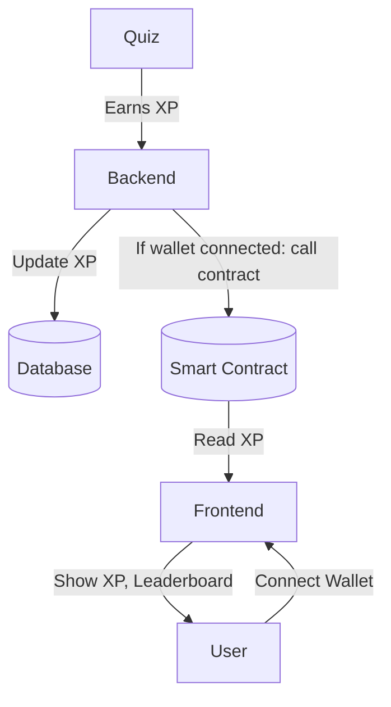

# Nexus.ai 🤖⚡  
**Your AI-Powered Career Mentor for Tech Professionals**

[](https://opensource.org/licenses/MIT)
[](https://github.com/your-repo/pulls)


> End-to-end AI platform that chains interview prep, resume analysis, and personalized learning into one adaptive system.

## 🌟 Features
| Feature | Tech Stack | Benefit |
|---------|------------|---------|
| **🎤 AI Mock Interview** | React Speech Recognition | Practice like real interviews with voice analysis |
| **📄 Smart Resume Scanner** | Gemini Pro, PDF.js | ATS-compliant feedback in 30 seconds |
| **🧭 Dynamic Roadmaps** | D3.js, PostgreSQL | Personalized learning paths with milestone tracking |
| **🧠 Career Copilot** | Gemini API 1.5 | 24/7 Q&A with context-aware responses |
| **⚔️ Contest Matcher** | Cheerio Scraping | Auto-suggests coding contests based on weak areas |

## 🚀 Getting Started

### Prerequisites
- Node.js v18+
- Gemini API key
- PostgreSQL database

### Installation
```bash
git clone https://github.com/your-repo/nexus.ai.git
cd nexus.ai
npm install
echo "GEMINI_API_KEY=your_key" > .env.local

This is a [Next.js](https://nextjs.org) project bootstrapped with [`create-next-app`](https://nextjs.org/docs/app/api-reference/cli/create-next-app).

## Getting Started

First, run the development server:

```bash
npm run dev
# or
yarn dev
# or
pnpm dev
# or
bun dev
```

Open [http://localhost:3000](http://localhost:3000) with your browser to see the result.

You can start editing the page by modifying `app/page.tsx`. The page auto-updates as you edit the file.

This project uses [`next/font`](https://nextjs.org/docs/app/building-your-application/optimizing/fonts) to automatically optimize and load [Geist](https://vercel.com/font), a new font family for Vercel.

## Learn More

To learn more about Next.js, take a look at the following resources:

- [Next.js Documentation](https://nextjs.org/docs) - learn about Next.js features and API.
- [Learn Next.js](https://nextjs.org/learn) - an interactive Next.js tutorial.

You can check out [the Next.js GitHub repository](https://github.com/vercel/next.js) - your feedback and contributions are welcome!

## Deploy on Vercel

The easiest way to deploy your Next.js app is to use the [Vercel Platform](https://vercel.com/new?utm_medium=default-template&filter=next.js&utm_source=create-next-app&utm_campaign=create-next-app-readme) from the creators of Next.js.

Check out our [Next.js deployment documentation](https://nextjs.org/docs/app/building-your-application/deploying) for more details.

## Quiz XP & Web3 Leaderboard Architecture


