# HexaFalls_Nexus.ai 🔮⚡

**AI-Powered Career Mentor for Tech Professionals**  
*Next.js | Gemini Pro | Tailwind CSS | PostgreSQL*


An end-to-end career platform featuring AI mock interviews, resume analysis, and dynamic learning roadmaps.

---

## 🧙‍♂️ Features
| Component               | Technology Used          | Key Benefit |
|-------------------------|--------------------------|-------------|
| AI Career Chat          | Gemini API               | Context-aware career Q&A |
| Resume Analyzer         | PDF.js + Gemini          | Instant ATS optimization tips |
| Dynamic Roadmap         | D3.js + PostgreSQL       | Personalized skill path |
| Mock Interview          | React Speech Recognition | Real-time feedback |
| Coding Contest Tracker  | Cheerio Web Scraping     | Personalized contest recommendations |

---

## 🏗️ Actual Project Structure
HexaFalls_Nexus.ai/
├── app/
│ ├── (auth)/ # Auth protected routes
│ ├── ai-tools/ # All AI tool components
│ │ ├── AiMockInterview/ # Voice interview system
│ │ ├── ai-chat/ # Career chat interface
│ │ ├── ai-resume-analyzer/ # Resume processing
│ │ └── ... # Other tools
│ ├── api/ # Edge API routes
│ └── dashboard/ # User progress tracking
├── components/
│ ├── ui/ # ShadCN components
│ ├── AiToolCard/ # Tool cards component
│ └── ... # Other shared components
├── lib/
│ ├── gemini/ # AI service handlers
│ ├── db/ # Prisma ORM models
│ └── scraping/ # Contest data fetchers
├── public/ # Static assets
└── styles/ # Global CSS

## 🔗 AI-Powered User Journey

```mermaid
%% Uncomment this if your MD renderer supports Mermaid
%% <div class="mermaid">
graph LR
    A[🔮 Career Chat] -->|"Analyze goals"| B[🗺️ Roadmap Generator]
    B -->|"Identify gaps"| C[🧠 Knowledge Quiz]
    C -->|"Target weak areas"| D[🏆 Contest Tracker]
    D -->|"Earn credentials"| E[📜 Resume Analyzer]
    E -->|"Optimize profile"| F[🎤 Mock Interview]
    F -->|"Prepare for roles"| A
%% </div>
```


## Tech Stack

- **Frontend**: Next.js 14, Tailwind CSS, ShadCN/ui
- **AI Core**: Gemini Pro 1.5
- **Database**: PostgreSQL
- **Infrastructure**: Vercel

## Getting Started

### Prerequisites

- Node.js v18+
- Gemini API key
- PostgreSQL database

### Installation

1. Clone the repository:
```bash
git clone https://github.com/your-repo/nexus.ai.git
cd nexus.ai

## 🚀 Getting Started

### Prerequisites
- Node.js v18+
- Gemini API key
- PostgreSQL database

### Installation
```bash
git clone https://github.com/your-repo/nexus.ai.git
cd nexus.ai
npm install
echo "GEMINI_API_KEY=your_key" > .env.local

This is a [Next.js](https://nextjs.org) project bootstrapped with [`create-next-app`](https://nextjs.org/docs/app/api-reference/cli/create-next-app).

## Getting Started

First, run the development server:

```bash
npm run dev
# or
yarn dev
# or
pnpm dev
# or
bun dev
```

Open [http://localhost:3000](http://localhost:3000) with your browser to see the result.

You can start editing the page by modifying `app/page.tsx`. The page auto-updates as you edit the file.

This project uses [`next/font`](https://nextjs.org/docs/app/building-your-application/optimizing/fonts) to automatically optimize and load [Geist](https://vercel.com/font), a new font family for Vercel.

## Learn More

To learn more about Next.js, take a look at the following resources:

- [Next.js Documentation](https://nextjs.org/docs) - learn about Next.js features and API.
- [Learn Next.js](https://nextjs.org/learn) - an interactive Next.js tutorial.

You can check out [the Next.js GitHub repository](https://github.com/vercel/next.js) - your feedback and contributions are welcome!

## Deploy on Vercel

The easiest way to deploy your Next.js app is to use the [Vercel Platform](https://vercel.com/new?utm_medium=default-template&filter=next.js&utm_source=create-next-app&utm_campaign=create-next-app-readme) from the creators of Next.js.

Check out our [Next.js deployment documentation](https://nextjs.org/docs/app/building-your-application/deploying) for more details.

